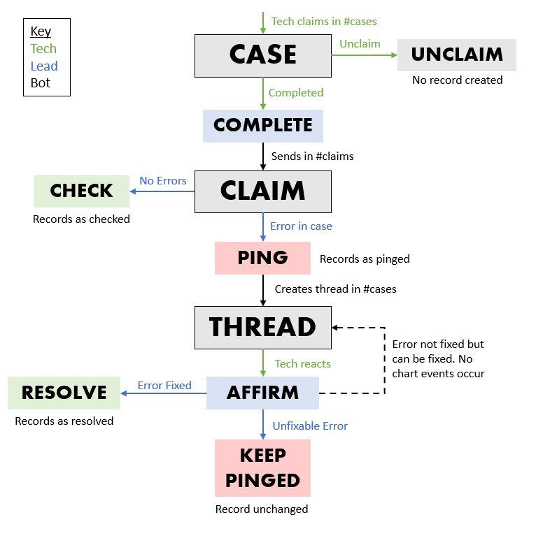

# Case Claim Bot
This repository contains the code to run the USD ITS Help Desk Case Claim bot. This bot is intended to be run with Python [3.11.3](https://www.python.org/downloads/release/python-3113/).

## How to Run
1. Verify Python version

    On Windows: `python -V` OR `py -V`
    
    On Mac: `python3 -V`

    Ensure that the result of these commands is `Python 3.11.3`.
2. Download dependencies

    On Windows:
    `python -m pip install -r requirements.txt` OR `py -m pip install -r requirements.txt`

    On Mac:
    `python3 -m pip3 install -r requirements.txt`

3. Run the `main.py` file
4. Add required information to `config.json`
5. Run the `main.py` file

## Database Setup
The database managing all the claims, users, and announcements/outages is run with
[MySQL](https://www.mysql.com/) and the relating files can be found in the `sql` folder.

A diagram of the table layout of the database can be found
[here](https://drawsql.app/teams/andrews-team-22/diagrams/itstest/embed).

To setup, first download the latest version of MySQL. Then, create a database and run the `createdb.sql` file by running the following:
1. ```mysql> CREATE DATABASE ITSCaseClaim```
2. ```mysql> USE ITSCaseClaim```
3. ```mysql> source /path/to/file/createdb.sql```

## File Structure
```bash
.
├── main.py # Organizes files and runs bot
├── token.txt # Token for the Discord bot
├── config.json # Channel IDs
├── temp.csv # Stores reports
├── discord.log # Stores all log messages
├── sql
    ├── cleardb.sql # Clears all of the tables in the database
    ├── createdb.py # Creates all of the tables in the database
    └── viewdb.py # Shows the contents of all of the tables in the database
└── bot
    ├── bot.py # Initializes all commands and views
    ├── helpers.py # Lists some shared functions
    ├── paginator.py # Creates embed pages that can be traversed
    ├── status.py # Lists case status enum values
    ├── cogs
        ├── announcement_command.py # /announcement
        ├── casedist_command.py # /casedist
        ├── caseinfo_command.py # /caseinfo
        ├── claim_command.py # /claim
        ├── getlog_command.py # /getlog
        ├── help_command.py # /help
        ├── join_command.py # /join
        ├── leaderboard_command.py # /leaderboard
        ├── leaderstats_command.py # /leadstats
        ├── mickie_command.py # /mickie
        ├── mycases_command.py # /mycases    
        └── report_command.py # /report
    ├── forms
        ├── affirm_form.py # Feedback form for affirming
        ├── announcement_form.py # Feedback form for announcements
        ├── edit_outage_form.py # Feedback form for editing outages
        ├── join_form.py # Feedback form for creating users
        ├── kudos_form.py # Feedback form for kudos
        ├── outage_form.py # Feedback form for outages
        └── ping_form.py # Feedback form for pings
    ├── models
        ├── active_claims.py # An OOP representation of an actively claimed case
        ├── announcement.py # An OOP representation of an announcement
        ├── checked_claim.py # An OOP representation of an checked claimed case
        ├── completed_claim.py # An OOP representation of a completed claimed case (before checking)
        ├── database_item.py # An abstract OOP representation of a database item
        ├── outage.py # An OOP representation of an outage
        ├── ping.py # An OOP representation of a ping
        └── user.py # An OOP representation of a user
    └── views
        ├── affirm_view.py # Affirm button
        ├── check_view.py # Kudos, Check, Done, Ping buttons
        ├── check_view_red.py # Kudos, Check, Done, Ping buttons (grayed out)
        ├── claim_view.py # Complete and Unclaim buttons
        ├── kudos_view.py # Thanks! button
        ├── leaderboard_view.py # Refresh and My Rank buttons
        ├── leadstats_view.py # Month and Semester buttons
        ├── outage_view.py # Update and Close buttons
        └── resolve_ping_view.py # Change Status and Keep Pinged buttons
```

## Config File Structure
Here's how the `config.json` file should be formatted (replace zeros with ID numbers).
```json
{
  "cases_channel": 0,
  "claims_channel": 0,
  "error_channel": 0,
  "announcement_channel": 0,
  
  "teams": [
    0,
    0,
    0,
    0,
    0
  ],
  
  "db_user": "",
  "db_password": "",
  "db_host": "",
  "db_name": ""
}
```

## Role Permissions
Giving these roles these specific permissions allows for the slash commands to only be seen by these roles.
This is beneficial because there are many commands which a standard tech wouldn't use.
- Tech: `N/A`
- Lead: `Mute Members`
- Phone Analyst: `Administrator`

## Commands
- /claim **<case_num>**
    - Allows a tech to claim a case and ensure that no other techs will work on that case.
    - Once a case is completed, a lead is able to review that case, and ping it if necessary.
    - When a lead pings a case, they can provide a description and a severity level.
    - This feedback will be shared with the tech in a private thread.
- /help
    - Shows all commands for the bot with descriptions.
- /join
    - Allows a user to add themselves to the `Users` table in the database.
    - Asks for a user's first and last name.
- /caseinfo **\<case_num>**
    - Allows a lead or a tech to see the history of a case and see who's worked on it previously.
    - Techs can see who's worked on the case and the timestamp.
    - Leads can see the case comments in addition to whose worked on it and the timestamp.
- /mycases
    - Allows a user to see a list of cases they've worked on.
    - Shows a paginated list containing the time and case numbers.
- /mickie
    - A fun command that essentially allows users to ping the bot and ensure it's online.
## Commands (for Leads)
- /report **\[user]** **\[month]** **\[pinged]**
    - Allows a lead to instantly create a report on filtered cases.
    - Leads can filter depending on a user, month, or whether or not the case was pinged.
    - These parameters are optional and can be used in conjunction with one another.
- /leaderboard
    - Allows a user to see a leaderboard of all other users by case claim amount.
    - Shows a paginated view of each user and how many cases they've claimed.
- /leadstats
    - Allows a user to see a leaderboard of all leads by cases they've checked and how many have been pinged
    - Uses matplotlib to create a stacked bar chart displaying the information
- /getlog
    - Allows a lead to get a copy of the log file so that they can view all messages
- /casedist **\<days>**
    - Allows a lead to see the distribution of case claim time throughout the day.
    - Uses matplotlib to create a histogram displaying the information.
- /export
    - Allows a lead to convert all tables in the MySQL database into CSV files
    - These files can be stored on another system as a backup
## Commands (for PAs)
- /announcement **<Outage/Announcement>**
  - Allows a PA to make an announcement or an outage.
  - Prompts the PA with a modal where they can input information
  - A message will appear in the announcements channel and a sticky message will appear in the cases channel


## Case Claim Flow Chart


## Dependencies
- discord.py [2.2.2](https://pypi.org/project/discord.py/)
- matplotlib [3.7.2](https://pypi.org/project/matplotlib/)
- mysql-connector-python [8.1.0](https://pypi.org/project/mysql-connector-python/)